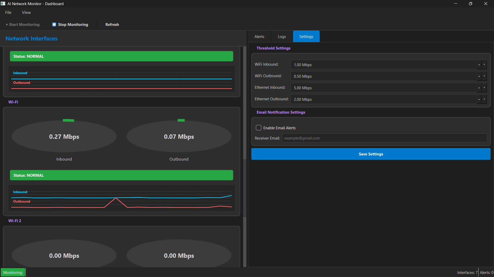
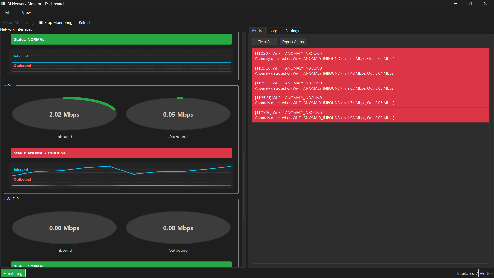
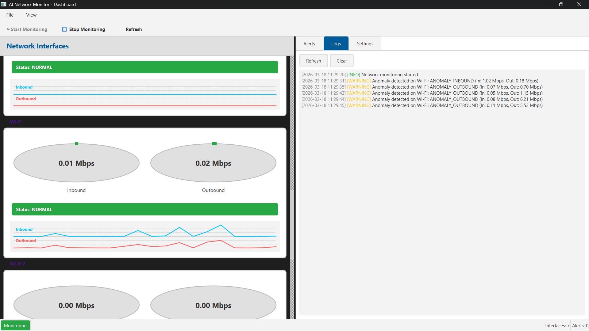
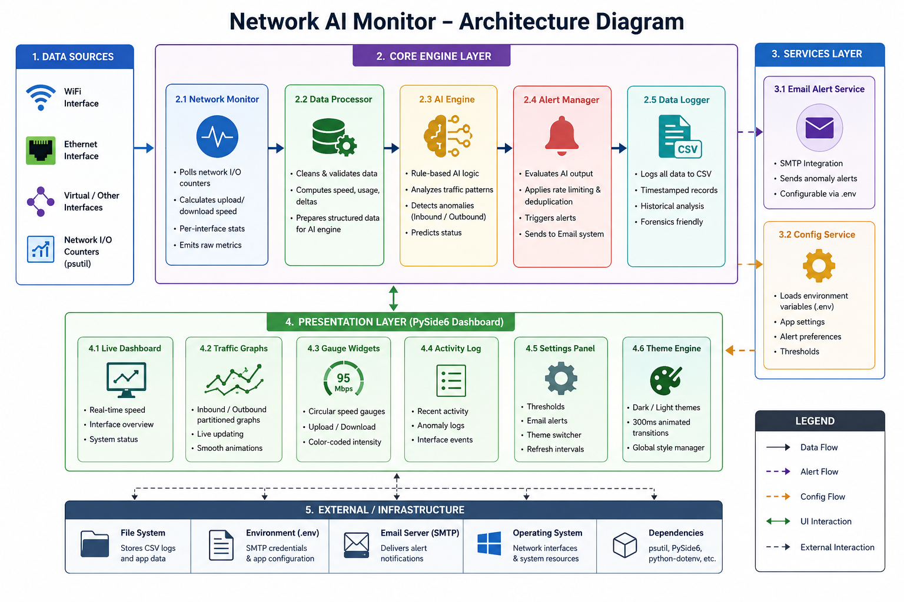
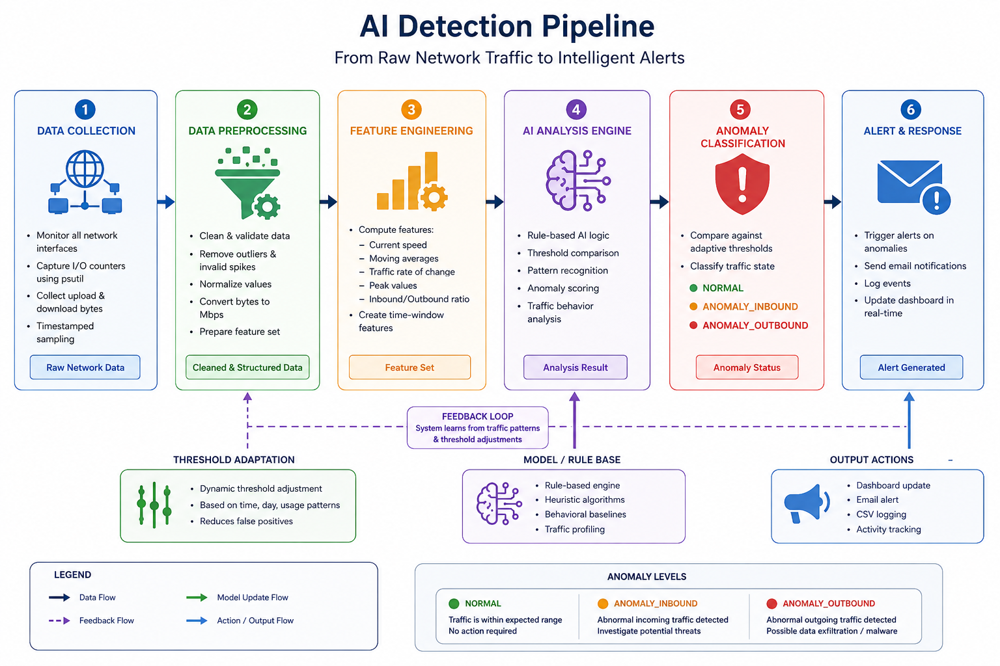

# 🚀 Network AI Monitor

### AI-Powered Real-Time Network Traffic Intelligence Platform

<p align="center">

  
  
  
  

</p>

---

<p align="center">
  <b>Monitor • Analyze • Detect • Secure</b>
</p>

---

<p align="center">
  Real-time bandwidth analytics, AI-powered anomaly detection, live visualization dashboards,  
  and cybersecurity-focused traffic intelligence — all inside a modern Python desktop application.
</p>

---

# ✨ Preview

<p align="center">
  
</p>

---

# 🔥 Highlights

<table>
<tr>
<td width="50%">

## ⚡ Real-Time Monitoring

* Live upload/download tracking
* Per-interface bandwidth analytics
* High-frequency throughput polling
* WiFi + Ethernet support

</td>

<td width="50%">

## 🧠 AI Traffic Detection

* Suspicious activity recognition
* Traffic spike analysis
* Inbound/Outbound anomaly prediction
* Intelligent threshold engine

</td>
</tr>

<tr>
<td width="50%">

## 🎨 Modern Cyber Dashboard

* Animated traffic gauges
* Live graph rendering
* Dark/Light theme engine
* Smooth 300ms transitions

</td>

<td width="50%">

## 🔒 Security-Oriented Design

* SMTP alerting system
* Environment variable isolation
* CSV forensic logging
* Multithreaded architecture

</td>
</tr>
</table>

---

# 🌐 Live Features

```diff
+ Real-Time Interface Monitoring
+ AI-Based Anomaly Detection
+ Historical Traffic Logging
+ Animated Dashboard Widgets
+ Cyberpunk Theme Engine
+ Email Alert System
+ Responsive Desktop UI
+ Multi-Threaded Processing
+ Performance Optimized Rendering
```

---

# 🖥️ Dashboard Showcase

## 📊 Traffic Analytics Interface

<p align="center">
  
</p>

---

## 🌑 Dark Theme UI

<p align="center">
  
</p>

---

## ☀️ Light Theme UI

<p align="center">
  
</p>

---

# ⚡ Quick Start

## 🖥️ Desktop Installation (Recommended)

### Download Pre-built Installer

[](https://github.com/Viraj-mvp/Network-Monitor-AI/releases/latest)

**Latest Release:** [Download Network AI Monitor v1.0.0](https://github.com/Viraj-mvp/Network-Monitor-AI/releases/latest)

### Installation Steps

1. **Download** the latest `NetworkAIMonitor-Setup-v1.0.0.exe` from [Releases](https://github.com/Viraj-mvp/Network-Monitor-AI/releases)
2. **Run** the installer and follow the setup wizard
3. **Launch** Network AI Monitor from your Desktop or Start Menu
4. **Configure** your email alerts in Settings (optional)

### System Requirements

- Windows 10/11 (64-bit)
- 4GB RAM minimum (8GB recommended)
- 100MB free disk space
- Network interface (WiFi/Ethernet)

### Portable Version

For users who prefer a portable app without installation:

1. Download `NetworkAIMonitor-Portable.exe` or `NetworkAIMonitor-Portable.zip`
2. Extract to any folder (for ZIP version)
3. Run `NetworkAIMonitor.exe` directly
4. All data saved in the same folder

---

## 🛠️ Developer Setup

### Clone Repository

```bash
git clone https://github.com/Viraj-mvp/Network-Monitor-AI.git
cd Network-Monitor-AI
```

### 1️⃣ Install Dependencies

```bash
pip install -r requirements.txt
```

---

## 2️⃣ Run Application

```bash
python dashboard_main.py
```

### Building Desktop App (Developers)

To build the desktop installer locally:

```bash
# Install build dependencies
pip install pyinstaller pillow

# Build using the build script
python build.py --all

# Or build individual components
python build.py --onefile     # Portable executable
python build.py --installer   # Windows installer (requires Inno Setup)
```

**Requirements for building installer:**
- [Inno Setup 6](https://jrsoftware.org/isdl.php) (for Windows installer)
- Python 3.8 or higher
- Windows 10/11

---

## 📦 GitHub Actions Auto-Build

This repository automatically builds desktop apps on every release:

1. Create a new tag: `git tag v1.0.0`
2. Push the tag: `git push origin v1.0.0`
3. GitHub Actions will build and attach installers to the release
4. Users can download directly from the Releases page

---

---

# 🏗️ System Architecture

<p align="center">
  
</p>

---

```text
┌──────────────────────┐
│ Network Interfaces   │
└──────────┬───────────┘
           │
           ▼
┌────────────────────────┐
│ network_monitor.py     │
│ psutil Traffic Engine  │
└──────────┬─────────────┘
           │
           ▼
┌────────────────────────┐
│ ai_engine.py           │
│ Traffic Intelligence   │
└──────────┬─────────────┘
           │
 ┌─────────┴─────────┐
 ▼                   ▼
CSV Logging     Email Alerts
           │
           ▼
┌────────────────────────┐
│ PySide6 Dashboard      │
│ Live Visualization UI  │
└────────────────────────┘
```

---

# 📂 Project Structure

```text
network-ai-monitor/
│
├── core/
│   ├── network_monitor.py
│   ├── ai_engine.py
│   └── email_alert.py
│
├── dashboard/
│   ├── main_window.py
│   ├── widgets.py
│   └── theme.py
│
├── services/
├── docs/
├── tests/
│
├── dashboard_main.py
├── requirements.txt
├── .env.example
└── README.md
```

---

# 🧠 AI Detection Pipeline

<p align="center">
  
</p>

---

```text
Network Traffic
      ↓
Packet Throughput Sampling
      ↓
Behavior Pattern Analysis
      ↓
Threshold Intelligence Engine
      ↓
Anomaly Classification
      ↓
Alert Dispatch + Logging
```

---

# 🎨 UI & Theme Engine

| Feature       | Description                               |
| ------------- | ----------------------------------------- |
| 🌑 Dark Mode  | Cyberpunk-inspired monitoring environment |
| ☀️ Light Mode | WCAG AA accessible high-contrast theme    |
| ✨ Animations  | 300ms smooth interpolated transitions     |
| 📱 Responsive | Supports 320px → 4K scaling               |
| ⚡ Optimized   | Minimal repaint architecture              |

---

# 📧 Email Alert System

Automatically sends alerts when suspicious activity is detected.

## Example Alert

```yaml
[ALERT]
Status: ANOMALY_OUTBOUND
Interface: WiFi
Upload Speed: 85 Mbps
Timestamp: 2026-05-07 14:30:12
```

---

# ⚙️ Environment Configuration

Create `.env`

```env
SMTP_SERVER=smtp.gmail.com
SMTP_PORT=587

SENDER_EMAIL=your-email@gmail.com
APP_PASSWORD=your-app-password

RECEIVER_EMAIL=receiver@gmail.com
```

---

# 📈 Performance Engineering

## ⚡ Optimizations

* MD5-based UI memoization
* Async background monitoring
* QThread-based processing
* Reduced redundant repaints
* Efficient graph rendering

---

## 🚀 Performance Results

| Metric               | Improvement            |
| -------------------- | ---------------------- |
| GUI Repaints         | ~90% Reduction         |
| UI Responsiveness    | Significantly Improved |
| Monitoring Stability | High                   |
| CPU Overhead         | Minimal                |

---

# 🔒 Security

## Security Features

```diff
+ Environment Variable Isolation
+ Secure SMTP Credential Handling
+ No Hardcoded Secrets
+ Dependency Vulnerability Audits
+ Background Thread Isolation
```

---

# 🧪 Testing

```bash
pytest tests/
```

---

# ⭐ Repository Stats Section


<p align="center">


</p>

---


# 👨‍💻 Author

### Built for:

* Cybersecurity Engineers
* SOC Analysts
* Ethical Hackers
* Network Researchers
* Performance Engineers

---

# 📁 Download Options

| Format | File | Description |
|--------|------|-------------|
| 💿 **Installer** | `NetworkAIMonitor-Setup-v1.0.0.exe` | Full Windows installer with Start Menu shortcuts |
| 📦 **Portable** | `NetworkAIMonitor-Portable.exe` | Single-file executable, no installation needed |
| 🗜️ **ZIP** | `NetworkAIMonitor-Portable.zip` | Portable version in ZIP format |
| 🐍 **Source** | `Source Code (zip)` | Original Python source code |

---

# 🌟 Support the Project

If you like the project:

```diff
+ ⭐ Star the repository
+ 🍴 Fork the project
+ 🛠️ Contribute improvements
+ 📢 Share with the community
```

---

# 🔥 Final Statement

> “Network visibility is the foundation of cybersecurity.”

**Network AI Monitor** transforms raw traffic into intelligent, actionable network insights using modern Python engineering, AI-assisted analysis, and real-time visualization systems.
"# Network-Monitor-AI" 
